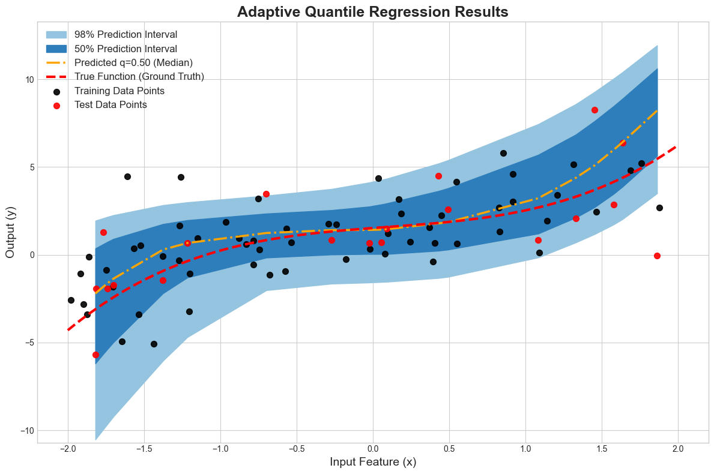

# Quantile-Conditioned Quantile Regression

This repository contains a PyTorch Lightning implementation of a **Quantile-Conditioned Quantile Regressor**. This is a neural network model trained to predict the entire conditional distribution of a target variable, `y`, given an input, `x`.

The core idea is to train a single model that takes both the input feature `x` and a target quantile `τ ∈ [0, 1]` as inputs. By treating the quantile as a feature, the model learns to adapt its predictions to any desired quantile at inference time, without needing to be retrained.

---

## Key Features

- **Adaptive Predictions**: A single model predicts any quantile, from `τ=0.01` to `τ=0.99`.
- **Deep Learning Model**: Implemented with PyTorch and PyTorch Lightning, featuring optional residual blocks for deeper architectures.
- **Pinball Loss**: The model is optimized using the pinball loss function, which is the standard for quantile regression.
- **Experiment Tracking**: Integrated with **Weights & Biases (W&B)** for seamless logging of metrics, hyperparameters, and model checkpoints.
- **Synthetic Data**: Includes a flexible `LightningDataModule` that generates polynomial data with tunable heteroscedastic noise, creating a challenging and realistic regression problem.
- **Clear Visualization**: A Jupyter notebook is provided to visualize the results, plotting prediction intervals and the median against the ground truth.

---

## Example Visualization

After training, the model can predict various quantiles to form prediction intervals. The visualization notebook (`visualize.ipynb`) produces a plot like the one below, showing the 50% and 90% prediction intervals.



---

## Project Structure

The repository is organized to separate concerns, making the code modular and easy to maintain.

```
adaptive-quantile-regression/
├── checkpoints/         # Saved model checkpoints
├── assets/              # Contains images for the README
│   └── quantile_regression_plot.png
├── src/
│   ├── data.py          # LightningDataModule for data generation
│   ├── loss.py          # Pinball loss function
│   └── model.py         # LightningModule for the QuantileRegressor
├── config.yaml          # All hyperparameters and settings
├── requirements.txt     # Project dependencies
├── train.py             # Main script to run training
└── visualize.ipynb      # Jupyter notebook for plotting results
```

---

## How to Run

### 1. Setup

First, clone the repository and install the required dependencies.

```bash
git clone [https://github.com/kyunghyuncho/adaptive-quantile-regression.git](https://github.com/kyunghyuncho/adaptive-quantile-regression.git)
cd adaptive-quantile-regression
pip install -r requirements.txt
```

### 2. Log in to W&B

The project uses Weights & Biases for logging. Log in to your account from the terminal.

```bash
wandb login
```

### 3. Configure and Train

All hyperparameters for the data, model, and training loop are located in `config.yaml`. You can modify this file to run different experiments.

Start the training by running the `train.py` script.

```bash
python train.py
```

The script will automatically use the settings from `config.yaml`, log everything to W&B, and save the best model checkpoint in the `checkpoints/` directory.

### 4. Visualize Results

Once training is complete, open and run the `visualize.ipynb` notebook to see the final plots.

```bash
jupyter notebook visualize.ipynb
```